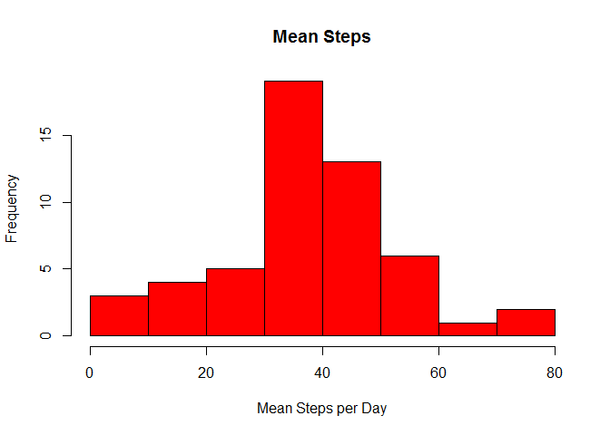
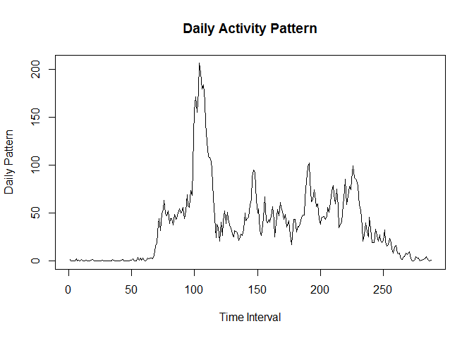
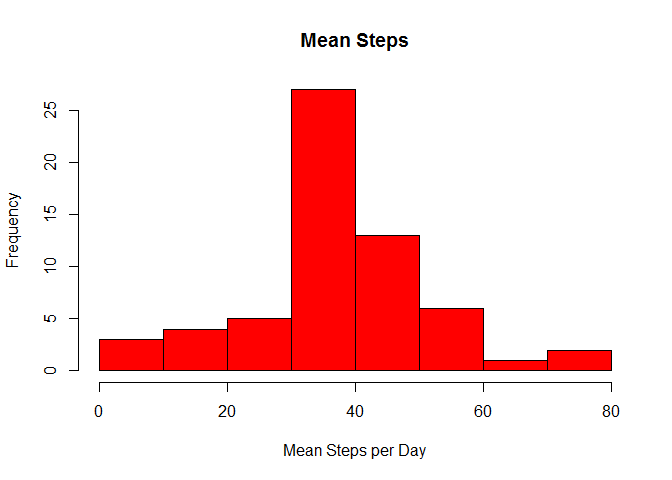
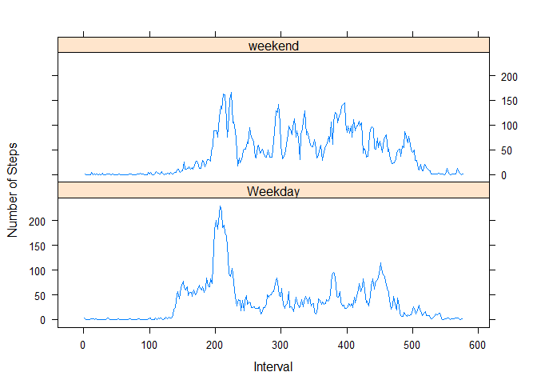

# Reproducible Research: Peer Assessment 1


## Loading and preprocessing the data

```r
## Read the data
unzip("activity.zip" )
data<- read.csv("./activity.csv",  sep=",", header = TRUE)

## convert the date column into class date
data$date <- as.Date(data$date, format = "%Y-%m-%d")

## print the first few elements
head(data)
```

```
##   steps       date interval
## 1    NA 2012-10-01        0
## 2    NA 2012-10-01        5
## 3    NA 2012-10-01       10
## 4    NA 2012-10-01       15
## 5    NA 2012-10-01       20
## 6    NA 2012-10-01       25
```


## What is mean total number of steps taken per day?

```r
## get the mean across each day
meandata <- aggregate(data$steps, list(data$date), mean, na.action = na.omit, na.rm=TRUE)

## plot the histogram for daily steps
hist(meandata$x , col = "red", xlab = "Mean Steps per Day", main = "Mean Steps")
```



```r
## mean number of steps
mean(meandata$x, na.rm = TRUE)
```

```
## [1] 37.3826
```

```r
## median number of steps
median(meandata$x, na.rm = TRUE)
```

```
## [1] 37.37847
```


## What is the average daily activity pattern?

```r
## get the mean across intervals
dailydata <- aggregate(data$steps, list(data$interval), mean, na.action = na.omit, na.rm=TRUE)

## plot the average time series
plot(dailydata$x,type="l" , ylab = "Daily Pattern",xlab = "Time Interval", main = "Daily Activity Pattern")
```



```r
## The interval with the maximum number of steps is at 
which.max(dailydata$x)
```

```
## [1] 104
```

```r
dailydata$Group.1[which.max(dailydata$x)]
```

```
## [1] 835
```


## Imputing missing values

```r
sum(is.na(data$steps))
```

```
## [1] 2304
```

```r
## copy data into a new data frame
datanona <- data

## loop to replace each na value with the mean of that interval
for(i in 1:nrow(datanona)){
  if (is.na(datanona[i,1])){
    datanona[i,1] = dailydata[which(dailydata$Group.1 == datanona[i,3]),]$x
  }
  
}

## confirm all na values are changed
sum(is.na(datanona$steps))
```

```
## [1] 0
```

```r
## get the mean across days
meandatanona <- aggregate(datanona$steps, list(datanona$date), mean, na.action = na.omit, na.rm=TRUE)

## plot the histogram
hist(meandatanona$x , col = "red", xlab = "Mean Steps per Day", main = "Mean Steps")
```



```r
## The mean number of steps
mean(meandatanona$x, na.rm = TRUE)
```

```
## [1] 37.3826
```

```r
## median number of steps
median(meandatanona$x, na.rm = TRUE)
```

```
## [1] 37.3826
```

```r
## The mean value is the same as before but the median is different and there is a slight change in the histogram
```


## Are there differences in activity patterns between weekdays and weekends?

```r
## vector of weekend days
weekend = c("Saturday","Sunday")

## add a factor column indicating whether it is a weekday or weekend
data$day <- factor(weekdays(data$date) %in% weekend, labels = c("Weekday","weekend"))

## get the mean for each interval for each category, weekday or weekend
meandataweekde <- aggregate(datanona$steps, list(data$day,data$interval), mean, na.action = na.omit, na.rm=TRUE)
meandataweekde$Group.1 <- factor(meandataweekde$Group.1)
library(lattice)

## plot the time series for weekdays and weekends
xyplot(   x ~ seq(1,length(meandataweekde$x),1) | Group.1, data = meandataweekde, type="l", ylab = "Number of Steps", xlab = "Interval",  layout = c(1,2))
```



